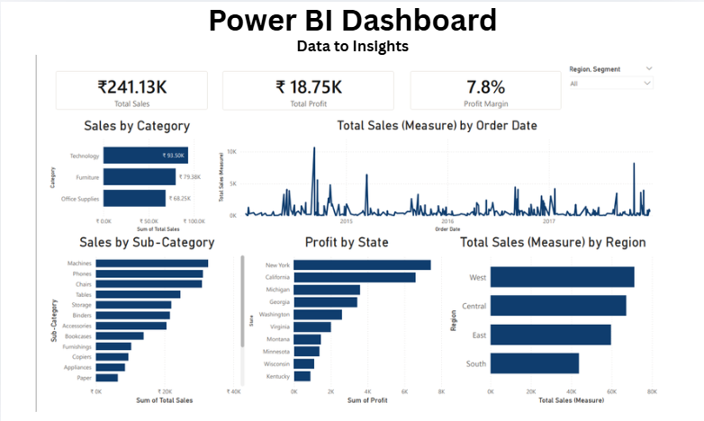

# 📊 Sales Dashboard (Power BI)

> Interactive dashboard built to derive actionable insights from sales data

## 📌 Overview
This project presents a Sales Performance Dashboard built using Power BI to analyze revenue, customer behavior, and regional trends.

## 📁 Dataset
- Contains sales transactions data  
- Includes fields like revenue, country, product category, and customer details  

## 📊 Key Insights
- Identified overall sales trends across available data
- Analyzed performance of different product categories
- Observed patterns in customer purchasing behavior  

## 🛠 Tools Used
- Power BI  
- Excel  

## 📷 Dashboard Preview

## 💼 Business Impact
- Helps stakeholders identify high-performing markets  
- Supports decision-making for product focus and regional strategy  
- Enables quick tracking of sales performance trends  

## 🚀 How to Use
1. Download the `.pbix` file  
2. Open in Power BI Desktop  
3. Explore the interactive dashboard  
